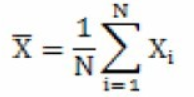
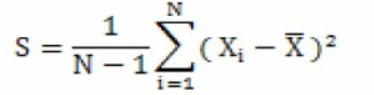
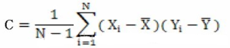

# 机器学习基础

## 环境配置
请在环境配置目录下查看  

## 机器学习中的三类问题
1. **分类问题**  
根据数据样本上抽取出的特征，判定其属于有限个类别中的哪一个。比如：  
* 垃圾邮件识别(结果类别：1、垃圾邮件 2、正常邮件)
* 文本情感褒贬分析(结果类别：1、褒 2、贬)
* 图像内容识别识别(结果类别：1、喵星人 2、汪星人 3、人类 4、草泥马 5、都不是)。

2. **回归问题**  
根据数据样本上抽取出的特征，预测一个连续值的结果。比如：  
* 星爷《美人鱼》票房
* 大帝都2个月后的房价
* 隔壁熊孩子一天来你家几次

3. **聚类问题**  
根据数据样本上抽取出的特征，让样本抱抱团(相近/相关的样本在一团内)。比如：
* google的新闻分类
* 用户群体划分

我们再把上述常见问题划到机器学习最典型的2个分类上。  
**分类与回归**问题需要用已知结果的数据做训练，属于**监督学习**  
**聚类**的问题不需要已知标签，属于**非监督学习**。  

## 机器学习应用
1. **计算机视觉**  
* 典型的应用包括：人脸识别、车牌识别、扫描文字识别、图片内容识别、图片搜索等等。  
2. **自然语言处理**  
* 典型的应用包括：搜索引擎智能匹配、文本内容理解、文本情绪判断，语音识别、输入法、机器翻译等等。  
3. **社会网络分析**  
* 典型的应用包括：用户画像、网络关联分析、欺诈作弊发现、热点发现等等。  
4. **推荐**  
典型的应用包括：虾米音乐的“歌曲推荐”，某宝的“猜你喜欢”等等。  

## 常用算法  
1. 处理分类问题的常用算法包括：逻辑回归(工业界最常用)，支持向量机，随机森林，朴素贝叶斯(NLP中常用)，深度神经网络(视频、图片、语音等多媒体数据中使用)。  
2. 处理回归问题的常用算法包括：线性回归，普通最小二乘回归（Ordinary Least Squares Regression），逐步回归（Stepwise Regression），多元自适应回归样条（Multivariate Adaptive Regression Splines）  
3. 处理聚类问题的常用算法包括：K均值（K-means），基于密度聚类，LDA等等。  
4. 降维的常用算法包括：主成分分析（PCA）,奇异值分解（SVD） 等。  
5. 推荐系统的常用算法：协同过滤算法  
6. 模型融合(model ensemble)和提升(boosting)的算法包括：bagging，adaboost，GBDT，GBRT  
7. 其他很重要的算法包括：EM算法等等。  

## 开发流程  
1. 抽象成数学问题   
> 明确问题是进行机器学习的第一步。机器学习的训练过程通常都是一件非常耗时的事情，胡乱尝试时间成本是非常高的。  
> 这里的抽象成数学问题，指的我们明确我们可以获得什么样的数据，目标是一个分类还是回归或者是聚类的问题，如果都不是的话，如何划归为其中的某类问题。  
2. 获取数据  
> 数据决定了机器学习结果的上限，而算法只是尽可能逼近这个上限。数据要有**代表性**，否则必然会过拟合。而且对于分类问题，**数据偏斜不能过于严重**，不同类别的数据数量不要有数个数量级的差距。而且还**要对数据的量级有一个评估**，多少个样本，多少个特征，可以估算出其对**内存的消耗程度**，判断训练过程中内存是否能够放得下。如果放不下就得考虑改进算法或者使用一些降维的技巧了。如果数据量实在太大，那就要考虑分布式了。  
3. 特征预处理与特征选择  
> 良好的数据要能够提取出良好的特征才能真正发挥效力。特征预处理、数据清洗是很关键的步骤，往往能够使得算法的效果和性能得到显著提高。**归一化、离散化、因子化、缺失值处理、去除共线性等**，数据挖掘过程中很多时间就花在它们上面。这些工作简单可复制，收益稳定可预期，是机器学习的基础必备步骤。  
> 筛选出显著特征、摒弃非显著特征，需要机器学习工程师反复理解业务。这对很多结果有决定性的影响。特征选择好了，非常简单的算法也能得出良好、稳定的结果。这需要运用特征有效性分析的相关技术，如**相关系数、卡方检验、平均互信息、条件熵、后验概率、逻辑回归权重等**方法。  
4. 训练模型与调优  
> 直到这一步才用到我们上面说的算法进行训练。现在很多算法都能够封装成黑盒供人使用。但是真正考验水平的是调整这些算法的（超）参数，使得结果变得更加优良。这需要我们对算法的原理有深入的理解。理解越深入，就越能发现问题的症结，提出良好的调优方案。  
5. 模型诊断  
> 如何确定模型调优的方向与思路呢？这就需要对模型进行诊断的技术。  
> **过拟合、欠拟合**判断是模型诊断中至关重要的一步。常见的方法如**交叉验证，绘制学习曲线等**。**过拟合的基本调优思路**是增加数据量，降低模型复杂度。**欠拟合的基本调优思路**是提高特征数量和质量，增加模型复杂度。  
> **误差分析**也是机器学习至关重要的步骤。通过**观察误差样本**，全面分析误差产生误差的原因:是参数的问题还是算法选择的问题，是**特征的问题还是数据本身的问题……**   
> 诊断后的模型需要进行调优，调优后的新模型需要重新进行诊断，这是一个反复迭代不断逼近的过程，需要不断地尝试， 进而达到最优状态。  
6. 模型融合  
> 一般来说，模型融合后都能使得效果有一定提升。而且效果很好。工程上，主要提升算法准确度的方法是分别在模型的前端（特征清洗和预处理，不同的采样模式）与后端（模型融合）上下功夫。因为他们比较标准可复制，效果比较稳定。而直接调参的工作不会很多，毕竟大量数据训练起来太慢了，而且效果难以保证。  
7. 上线运行  
> 这一部分内容主要跟工程实现的相关性比较大。工程上是结果导向，模型在线上运行的效果直接决定模型的成败。 不单纯包括其准确程度、误差等情况，还包括其运行的速度(时间复杂度)、资源消耗程度（空间复杂度）、稳定性是否可接受。  
> 这些工作流程主要是工程实践上总结出的一些经验。并不是每个项目都包含完整的一个流程。这里的部分只是一个指导性的说明，只有大家自己多实践，多积累项目经验，才会有自己更深刻的认识。

## 方差和协方差区别
均值：

方差：

协方差：

方差和协方差区别：
1. 方差的计算公式，我们知道方差的计算是针对一维特征，即针对同一特征不同样本的取值来进行计算得到；而协方差则必须要求至少满足二维特征。可以说方差就是协方差的特殊情况。  　
2. 方差和协方差的除数是n-1，这样是为了得到方差和协方差的无偏估计

## 梯度下降法

批量梯度下降  
随机梯度下降  
小批量梯度下降  

https://github.com/user-ZJ/Supervised-learning/tree/master/%E7%BA%BF%E6%80%A7%E5%9B%9E%E5%BD%92

## 正则化
正则化方法是在训练数据不够多时，或者over training时，常常会导致过拟合（overfitting）。这时向原始模型引入额外信息，以便防止过拟合和提高模型泛化性能的一类方法的统称。在实际的深度学习场景中我们几乎总是会发现，最好的拟合模型（从最小化泛化误差的意义上）是一个适当正则化的大型模型。  
https://github.com/user-ZJ/Supervised-learning/tree/master/%E7%BA%BF%E6%80%A7%E5%9B%9E%E5%BD%92

## 熵
参考：https://blog.csdn.net/tsyccnh/article/details/79163834  

物理学熵表示粒子移动的自由度，熵越大，自由度越高；在此，表示数据离散程度  

### 信息熵
信息熵（information_entropy）是度量样本集合纯度最常用的指标  
  
n代表事件发生的n种可能性  
**信息熵值越小，样本纯度越高**

### 信息增益
信息增益为分类前的信息熵减去分类后的信息熵；  
假定离散属性a有V个可能的取值，若使用a来对样本集X进行划分，则会产生V个分支节点，其中第v个分支节点包含了X中所有在属性a上取值为av的样本，记为，为中样本数，信息增益公式如下：  
  
**信息增益越大，使用属性a来进行划分所获得的纯度提升越大**  
信息增益对可取值数目较多的属性有所偏好  

### 增益率
增益率公式为：  
  
  
数据集D通过A的属性值划分为m个子数据集，表示第v个子数据集中样本数量；|D|表示划分之前数据集中总样本数量。  属性A可能的取值数目越多，IV(a)值越大。
增益率对可取值数据较少的属性有所偏好  
C4.5算法并不直接选择增益率最大的候选划分属性，而是先从候选划分属性中招数信息增益高于平均水平的属性，再从中选择增益率最高的。  

### 相对熵（KL散度）
相对熵又称KL散度,如果我们对于同一个随机变量 x 有两个单独的概率分布 P(x) 和 Q(x)，我们可以使用 KL 散度（Kullback-Leibler (KL) divergence）来衡量这两个分布的差异  
  
n为事件的所有可能性
** DKL的值越小，表示q分布和p分布越接近 **

### 交叉熵
对相对熵变形可以得到  
  
等式的前一部分恰巧就是X在P(x)分布上的信息熵，等式的后一部分，就是交叉熵  
  
在机器学习中，我们需要评估label和predicts之间的差距，使用KL散度刚刚好，由于KL散度中的前一部分−H(X)不变，故在优化过程中，只需要关注交叉熵就可以了。所以一般在机器学习中直接用用交叉熵做loss，评估模型。

### 联合熵
将一维随机变量分布推广到多维随机变量分布，则其联合熵 (Joint entropy) 为：  

### 条件熵
条件熵 H(Y|X) 表示在已知随机变量 X 的条件下随机变量 Y 的不确定性。条件熵 H(Y|X) 定义为 X 给定条件下 Y 的条件概率分布的熵对  X 的数学期望：  
  
条件熵 H(Y|X) 相当于联合熵 H(X,Y) 减去单独的熵 H(X)，即  
H(Y|X)=H(X,Y)−H(X)  

